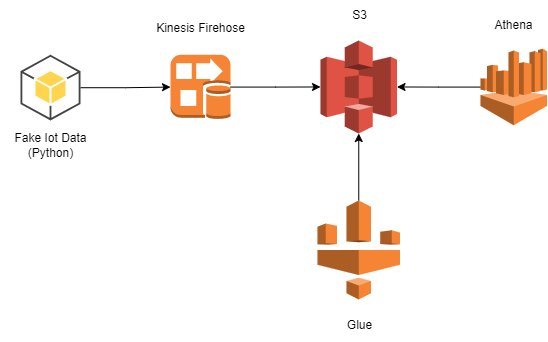

# Especificação

Este é um projeto pessoal baseado na minha experiência usando esses serviços no trabalho. Não pretende - se ser muito abrangente tanto em tamanho do tráfego de dados 
e de configurações personalizadas. A proposta é ser o mais simples possível e detalhando os serviços e pontos de melhoria.

# Arquitetura



Estaremos usando **terraform** para o gerenciamento dos serviços. Aqui vai uma breve descrição das suas atribuições

### Simulador de dados 

Esse serviço é construindo em python 3.9.1 e tem como finalidade simular dados fakes de um sensor de IOT. 
Os dados do contrato seriam:

- Temperatura
- Nivel de cpu
- Nivel de ram
- Nivel de HD
- Timestamp: Hora em que o dado foi criado
- Timestamp_sent: Hora em que o dado foi enviado (yyyy-mm-dd HH)

A partir da criação dos dados, envia - se para o **Kinesis** via Boto3

### Kinesis Firehose
Este serviço tem como objetivo receber os dados fakes da aplicação em python, transforma - los em arquivos parquet e inseri - los no S3 de forma particionada.

A escolha desse serviço foi feita pelas seguintes razões:

- Baixo custo de dado o tráfego: 0,029 USD por Gb nos primeiros 500GB
- Possibilidade de transformar o dado em parquet com configuração simples
- Possibilidade de inserir os dados de forma particionada no S3 de maneira simples
- Não precisa ser gerenciado

### S3
Este serviço permite os dados serem armazenados de forma barata e também possui integrações com alguns serviços de analytics da AWS como Athena e Redshift (Spectrum).
Criamos um bucket no S3 para receber os dados do kinesis. Esse bucket seria particionado pelo timestamp_sent vindo do kinesis. 
Aqui temos como ficaria no S3

### Glue
Destina - se a catalogar o database e a tabela que criaremos a partir dos dados do S3. Também rodará um crawler para leitura via Athena.

### Athena
Serviço de contato com usuário final. A partir deste, podemos fazer querys para buscar alguma informação ou métrica.

# Estrutura do projeto


# Como replicar

1. Clone o repositorio em sua máquina

```
git clone https://github.com/Karmendes/streaming_data_aws
```
2. Caso ainda não tenha, baixe o terraform e configure a variavel de ambiente path para o bin do terraform

3. Certifique - se que o seu computador tenha o CLI da AWS configurado.

3. Crie um ambiente virtual no python, va para o diretório **streaming_data_aws/src/fake_iot_data** e rode o seguinte comando

```
pip -r requiremnts.txt
```
4. Va para o diretório streaming_data_aws/src/infra e rode o seguinte comando

```
terraform apply
```

Espere até que tudo seja criado.

5. Na raiz do diretório, inicie o gerador de dados fakes.

```
python streaming_data_aws/src/fake_iot_dat/sender.py
```

6. Entre na sua conta na AWS, entre no servico do glue e coloque o crawler para rodar

7. Va até o serviço do athena, selecion o database e a tabela que fazem referência aos dados e pronto. Você ja estará habilitado a escrever querys diretamente no S3.

# O que poderia ser feito além?


1. **Permissões**: 
Por questão de simplicidade, eu criei roles com politicas muito abertas. O ideal é que você só de permissão para os recursos que estão sendo utilizados.

2. **Transformação adicional**:
Poderiamos colocar algum processo de ETL para tratar os dados de outra forma. Dividindo o bucket em raw, processed e trusted. Com isso os dados poderiam chegar 
brutos, serem transformados em parquet em um glue job, transformar as datas de string para date e disponibiliza - los na camada trusted.

3. **Processamento em Real-Time**:
Imagine que precisamos dar um alerta em tempo real sobre alguma anomalia nos dados. Poderiamos colocar na frente do firehose outro servico do kinesis, o data stream,
que funciona parecido com o kafka. Assim, uma outra aplicação poderia buscar esse dados e de acordo com sua regra de negócio detectar uma anomalia

4. **Gateway para a borda**:
Imagine que o script de dados fake virou uma aplicação real em dispositivo de IOT. Para não colocarmos credenciais na borda, por questão de segurança, poderiamos
colocar um gateway na frente dos serviços da AWS para que ele fizesse o redirecionamento para a Kinesis.
